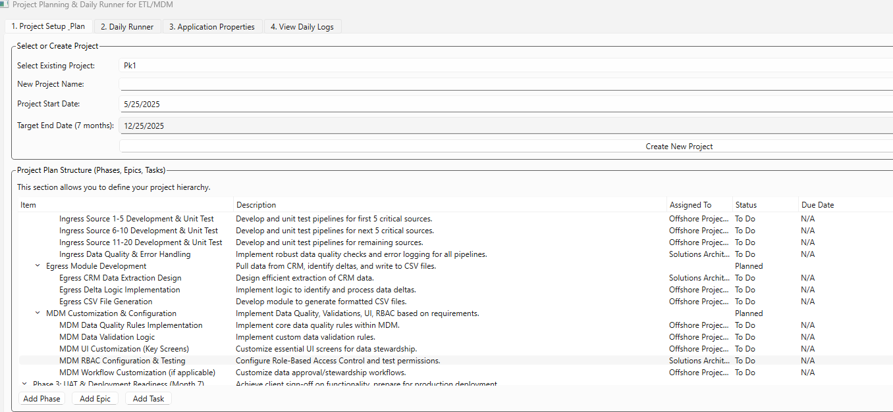

# Set up UV
powershell -ExecutionPolicy ByPass -c "irm https://astral.sh/uv/install.ps1 | iex"

# Prep project
```Command
uv venv
.venv\Scripts\activate.bat
uv tool install pip
uv pip compile --output-file=requirements.txt pyproject.toml
uv pip install -r requirements.txt
pre-commit install
python src/main_app.py
```


## 🧹 Format & Type Check

```bash
uv pip install black mypy
black src/
mypy src/
```


# VSCode HotKeys
## Note pay attn to upper case vs lower case
Note: add two spaces at the end of each line to force a 'New Line' Render
Select and widen by indent <alt><shft><right arrow>,  do the reverse <left arrow>.  
Recently used is <ctrl> e  
Navigate to Explorer (left pane) <ctrl> E  
Close Nav pane <ctrl> b  | <ctrl> B  
Close window <ctrl> W  

# Screenshots

Branch1  pic1   

# Branches

## Branch 001
```text
    commit msg: done- good state, close branch 001
    code written by Google Gemini. the prompt file is not uploaded to this project here.
    it did a decent job.
    to fix: the Add Phase, Add Epic and Add Task are not showing a dialog box to add the item name, desc, assigned to, status and due date
        once the user adds the inputs, it should add it to the approp hierarchy and persist to the DB
```

## Branch 002
```text
prompts: 
        
    modify the functionality of the buttons Add Phase, Add Epic and Add Task. these buttons should open a dialog box for the task
    The shape of the task is same as the Model Task
    once the user adds the inputs the task, it should add it to the appropriate hierarchy and persist to the DB

    great, nice work,  now I want you to auto select the parent Phase when the add Epic button is clicked
    
    when a task or epic is highlighted and then the epic button is click the focus is moving from the current selection to the very first in the Hierarchry, can you fix this

    great, nice work,  now I want you to auto select the parent Epic when the add task button is clicked

```


## Branch 003
```text
prompts: 
    Modify the main_app.py to start in full screen and move the "select or create Project" section to its own tab/screen   
    Modify the main_app.py to have Keyboard short cuts 'Add Phase' (space + p), 'Add Epic' (space + e) and 'Add Task' (space + t)
    Modify the main_app.py to make the Project Plan and structure pane occupy max screen 
    The table in the Project Setup Plan tab, is still not occupying the complete screen vertically
    modify _show_add_task_dialog to show the dialog box to occupy more screen size than currently set
```
